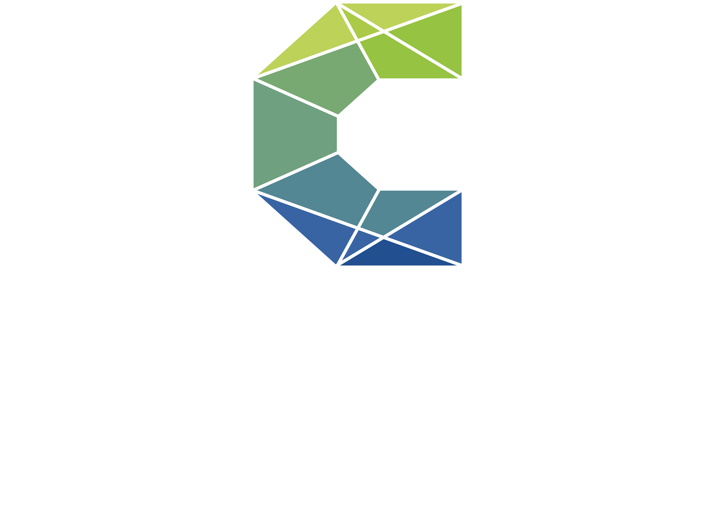

```{r load_packages, message=FALSE, warning=FALSE, include=FALSE} 
# devtools::install_github("rstudio/fontawesome")
# remotes::install_github("gadenbuie/xaringanExtra")
# remotes::install_github("gadenbuie/countdown")

library(fontawesome)
library(xaringanthemer)
library(countdown)
xaringanExtra::use_panelset()

options(htmltools.dir.version = FALSE)

style_mono_accent(
  base_color = "#272822",
  header_font_google = google_font("Roboto"),
  text_font_google   = google_font("Roboto", "300", "300i"),
  code_font_google   = google_font("Fira Mono")
)
```

class: inverse, center, middle

# Section slide 

---
class: inverse, middle, center
background-image: url("img/blue.png")
background-position: 0% 100%;
background-size: cover

# Section slide with color gradient (blue)

---
class: inverse, middle, center
background-image: url("img/red.png")
background-position: 0% 100%;
background-size: cover

# Section slide with color gradient (red)

---
# Only text

- Some text can be added here

- And more goes here

- You can also make parts **bold** or *italics*
  * Or indent bullets

> Write a block quote

Add emojis with different sizes <span style="font-size:3em">👩🏼‍💻</span><span style="font-size:2em">👩🏼‍💻</span><span style="font-size:1em">👩🏼‍💻</span><span style="font-size:0.5em">👩🏼‍💻</span>

---
# More styles

Add some inline code: `shinyApp(...)`

Or a table

| A          | B          | C          |
| :--------- | :--------: | ---------: |
| Something  | Else       | ?          |

---
class: hide-logo

# Full image (hide logo)
<br><br><br><br>


---
class: bg_img, hide-logo, progress-bar-hide

# Image as background

But you can add some text as well and it will be clearly visible.
&nbsp;
---
class: bg_img, hide-logo, progress-bar-hide

.full-width[.content-box-grey[
# Image with a text box

And you can add some text here as well and it will be clearly visible.
]]
---
# Two columns (image and text)

.pull-left[
<br><br>

]

.pull-right[
- Data Science ist ein interdisziplinäres Fachgebiet mit zahlreichen Anwendungsgebieten
<br><br><br>

- Es dient der Gewinnung von Erkenntnissen aus Daten
<br><br><br>

- Zielfragestellung: Wie können wir auf Basis von Daten bessere Entscheidungen treffen?
]

---
# Two columns (image and image)

.pull-left[

]

.pull-right[

]

---
# Three columns

.pull-left[
.left-column[
<br>

<br>
<br><br>

<br>
<br>

<br>
<br>

]
.right-column[
Projektpartner:in ist NGO, Verein mit sozialer Mission oder Stiftung
<br>
<br><br>
Projektpartner:in vertritt den Ethikkodex von CorrelAid 
<br>
<br>
<br>
Projektumfang liegt zwischen 1-6 Monaten 
<br>
<br>
<br>
Projekt würde ohne uns nicht realisiert werden 
]
]
.pull-right[
</br></br>

]


---
# Upgrade your images (1)

These features are presented [**here**](https://github.com/yihui/xaringan/blob/master/inst/examples/ghoul.Rmd)


.pull-left[
Nothing changed:

```{r echo=FALSE, out.width="40%"}
knitr::include_graphics("img/work.png")
```

`.polaroid`

.polaroid[
```{r echo=FALSE, out.width="40%"}
knitr::include_graphics("img/work.png")
```
]
]
.pull-right[

`.rotate-right`:

.rotate-right[
```{r echo=FALSE, out.width="40%"}
knitr::include_graphics("img/work.png")
```
]

`.blur`

.blur[
```{r echo=FALSE, out.width="40%"}
knitr::include_graphics("img/work.png")
```
] 
]

---
# Upgrade your images (2)

.pull-left[
`.opacity`

.opacity[
```{r echo=FALSE, out.width="40%"}
knitr::include_graphics("img/work.png")
```
]

Combine `.blur` and `.opacity`

.blur[.opacity[
```{r echo=FALSE, out.width="40%"}
knitr::include_graphics("img/work.png")
```
]]
]
.pull-right[

`.grayscale`:

.rotate-left[
.grayscale[
```{r echo=FALSE, out.width="40%"}
knitr::include_graphics("img/work.png")
```
]]

`.shadow`

.shadow[
```{r echo=FALSE, out.width="40%"}
knitr::include_graphics("img/work.png")
```
] 
]

---
# For workshops (1)

.panelset[
  .panel[.panel-name[Code]
```{r, message = FALSE, eval=FALSE}
# Load packages
library(dplyr)
library(ggplot2)

# Load data
data("mtcars")

# Generate a plot
mtcars %>%
*  ggplot() +
*  geom_smooth(aes(x = hp, y = mpg))
```
  ]
  .panel[.panel-name[Plot]
  .center[
```{r, message = FALSE, eval=TRUE, echo=FALSE}
library(dplyr)
library(ggplot2)
# Add some code here
data("mtcars")

mtcars %>%
  ggplot() +
  geom_smooth(aes(x = hp, 
                  y = mpg))
```
  ]]
]

---
# For workshops (2)


.pull-left[
**Code**
```{r, eval=FALSE, warning=FALSE, message=FALSE}
# Load packages
library(dplyr)
library(ggplot2)

# Load data
data("mtcars")

# Generate a plot
mtcars %>%
  ggplot() +
  geom_smooth(aes(x = hp, 
                  y = mpg))
```
]

.pull-right[
**Output**
```{r, echo=FALSE, warning=FALSE, message=FALSE}
# Load packages
library(dplyr)
library(ggplot2)

# Load data
data("mtcars")

# Generate a plot
mtcars %>%
  ggplot() +
  geom_smooth(aes(x = hp, y = mpg))
```
]

---
class: middle, center, hide-logo

<span style="font-size:3em">**Practice session** 💻</span>
```{r, echo=FALSE}
countdown::countdown(minutes = 5, seconds = 0)
```


---
class: inverse, center, middle

# Thank you

---
class: inverse, middle, center



`r fontawesome::fa(name = "globe", fill = "white")` [correlaid.org](https://correlaid.org) 

`r fontawesome::fa(name = "twitter", fill = "white")` [@CorrelAid](https://twitter.com/correlaid?lang=en)

`r fontawesome::fa(name = "linkedin", fill = "white")` [correlaid](https://www.linkedin.com/company/correlaid/)


