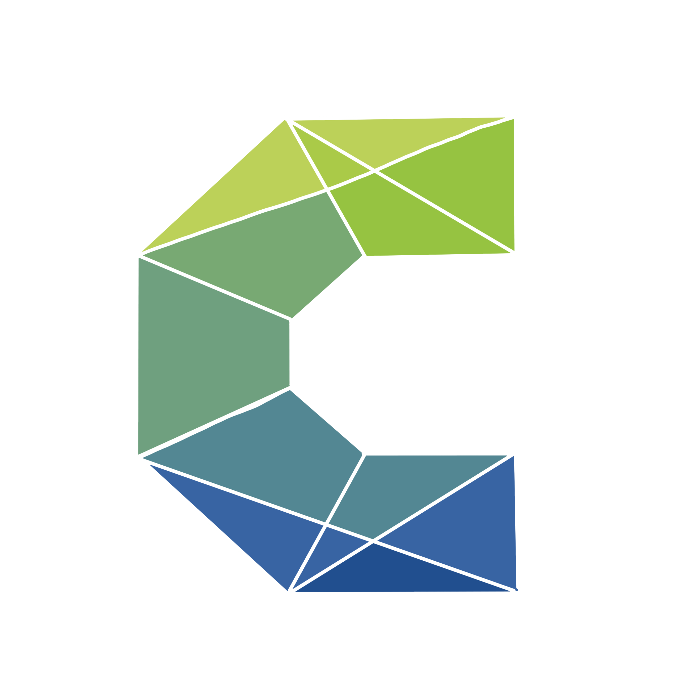

```{r load_packages, message=FALSE, warning=FALSE, include=FALSE} 
# devtools::install_github("rstudio/fontawesome")

library(fontawesome)
library(xaringanthemer)

options(htmltools.dir.version = FALSE)

style_mono_accent(
  base_color = "#272822",
  header_font_google = google_font("Roboto"),
  text_font_google   = google_font("Roboto", "300", "300i"),
  code_font_google   = google_font("Fira Mono")
)
```

class: inverse, center, middle

# Section slide 

---
# Only text

- Some text can be added here

- And more goes here

- You can also make parts **bold** or *italics*
  * Or indent bullets

> Write a block quote

---
# More styles

Add some inline code: `shinyApp(...)`

Or a table

| A          | B          | C          |
| :--------- | :--------: | ---------: |
| Something  | Else       | ?          |

---
class: hide-logo

# Full image (hide logo)
<br><br><br><br>


---
# Two columns (image and text)

.pull-left[
<br><br>

]

.pull-right[
- Data Science ist ein interdisziplinäres Fachgebiet mit zahlreichen Anwendungsgebieten
<br><br><br>

- Es dient der Gewinnung von Erkenntnissen aus Daten
<br><br><br>

- Zielfragestellung: Wie können wir auf Basis von Daten bessere Entscheidungen treffen?
]

---
# Two columns (image and image)

.pull-left[

]

.pull-right[

]

---
# Three columns

.pull-left[
.left-column[
<br>

<br>
<br><br>

<br>
<br>

<br>
<br>

]
.right-column[
Projektpartner:in ist NGO, Verein mit sozialer Mission oder Stiftung
<br>
<br><br>
Projektpartner:in vertritt den Ethikkodex von CorrelAid 
<br>
<br>
<br>
Projektumfang liegt zwischen 1-6 Monaten 
<br>
<br>
<br>
Projekt würde ohne uns nicht realisiert werden 
]
]
.pull-right[
</br></br>

]

---
class: inverse, center, middle

# Thank you

---
class: inverse, middle, center



`r fontawesome::fa(name = "globe", fill = "white")` [correlaid.org](https://correlaid.org) 

`r fontawesome::fa(name = "twitter", fill = "white")` [@CorrelAid](https://twitter.com/correlaid?lang=en)

`r fontawesome::fa(name = "linkedin", fill = "white")` [correlaid](https://www.linkedin.com/company/correlaid/)


